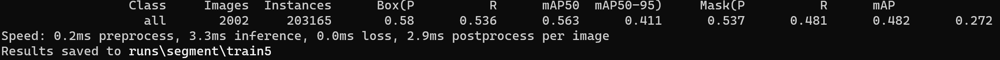

# Real-TimeSAM
This is an official implementation of Real-Time Segment Anything Model

The **Real-Time Segment Anything Model(RT-SAM)** is a Segment Anything Model trained using only 0.3% of the SA-1B dataset published by SAM authors. RT-SAM achieves comparable performance with the SAM method at **600× higher run-time speed**.

Running Speed under Different Point Prompt Numbers(ms).
| method | params | 1 | 10 | 100 | E(16x16) | E(32x32\*) | E(64x64) |
|:------------------:|:--------:|:-----:|:-----:|:-----:|:----------:|:-----------:|:----------:|
| SAM-H | 0.6G | 446 | 464 | 627 | 852 | 2099 | 6972 |
| SAM-B | 136M | 110 | 125 | 230 | 432 | 1383 | 5417 |
| FastSAM | 68M | 40 |40 | 40 | 40 | 40 | 40 |
| MobileSAM | 9.6M | 12 |31 | 201 | 433 | 1998 | 6619 |
| RT-SAM | 6.6M | 3.3 |3.3 | 3.3 | 3.3 | 3.3 | 3.3 |
